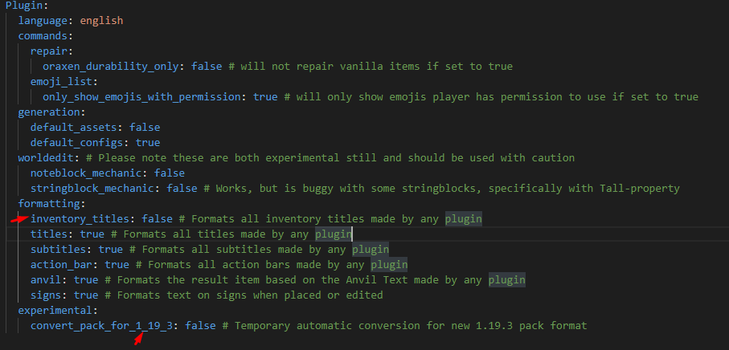

# ❓ Frequently Asked Questions

Here you will find the most requested questions and if you don't find it here, you can let me know so I can add it =).

## Why do all the cosmetics appear as unavailable?

<figure><figcaption>
Evidence of the problem.
</figcaption></figure>

It's very simple... you don't have added the permission path in your cosmetics. go to `MagicCosmetics/cosmetics/` and find your cosmetics file now proceed to add the permission path.\
Then save it and go to the game, and finally reload the files with `/cosmetics reload`.

## How do I add permission to a cosmetic?

<figure><figcaption>
Evidence of the problem.
</figcaption></figure>

It is that simple, you can rename the permission to your liking and if the path is not there, you add it.

## I just used the add-on for Oraxen with the latest version of Oraxen but my menu looks like this...

<figure><figcaption>
Evidence of the problem.
</figcaption></figure>

The problem occurs in that Oraxen in recent versions has the ability to format all inventory titles and that deforms the cosmetic inventory.\
\- Go to your Oraxen plugin folder and open the settings.yml file\
and deactivate the option inside `Plugin.formatting.inventory_titles` after this you will have to restart the server.\
\- If your server is lower than 1.19.3 disable this option `Plugin.experimental.convert_pack_for_1_19_3`.

<figure><figcaption>
plugins/Oraxen/settings.yml
</figcaption></figure>

Your question it's not solved? You can ask in our official [MagicPlugins Support Discord Server](https://discord.com/invite/XHjh5skj)
